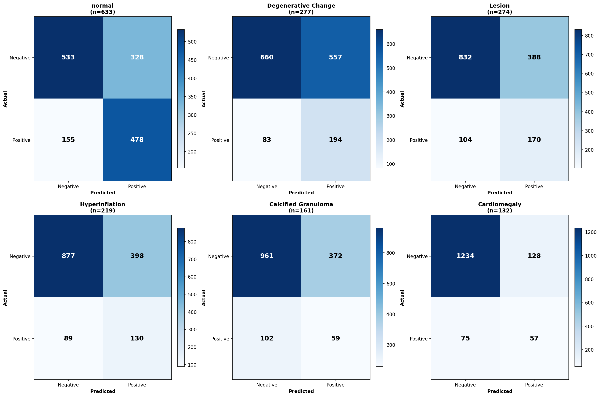

# BiomedCLIP Multi-Label Chest X-ray Classifier

## Overview

This module implements a **BiomedCLIP-based multi-label classification system** for chest radiography. It fine-tunes a pre-trained medical vision-language model (ViT-B/16) to predict 34+ disease categories from chest X-ray images.

### Core Components
- **Training Script** (`train_jaccard_new.py`) - Fine-tunes BiomedCLIP **multi-view** (frontal + lateral per patient) with Focal Loss and Soft Jaccard Loss
- **Inference Script** (`test_predicted_classes.py`) - Feature-level dual-view fusion and conflict resolution for test predictions
- **Dataset** - Indiana University chest X-ray collection with clinical labels

### Key Features
- **Multi-label classification** - Each patient can have multiple concurrent diseases
- **Multi-view (feature-level) fusion** - Frontal and lateral X-rays are encoded and their feature vectors fused inside the model, learned jointly during training
- **Conflict resolution** - Normal/Disease probability conflicts handled systematically
- **KG integration** - Output feeds into Knowledge Graph traversal

> **Note:** As of the multi-view revision, one training/inference sample = **one patient (uid)** carrying both views, and fusion happens at the **feature level** inside the model (not post-hoc probability blending). Performance tables below were produced by the *previous* single-view + weighted-average model and will be refreshed after retraining with the multi-view pipeline.

---

## Dataset Characteristics

This dataset is a **clinical chest X-ray radiology report corpus** designed for **medical image–text understanding**, **radiology report analysis**, and **clinical AI research**.  
The `label` column represents **one or more thoracic disease categories** associated with each study and serves as the ground-truth target for **multi-label supervised learning**.


---

## Dataset Characteristics

- **Modality:** Chest X-ray (PA / Lateral)
- **Data Type:** Clinical radiology reports + corresponding images
- **Task Type:** **Multi-label classification**
- **Total Classes:** 34
- **Total Images:** 7,466 validated X-ray images (~14 GB)
- **Total Reports:** 3,852 radiology reports

---

## Disease Class Labels (34 Classes)

1. Normal
2. Degenerative Change
3. Lesion
4. Hyperinflation
5. Calcified Granuloma
6. Cardiomegaly
7. Volume Loss
8. Calcinosis
9. Airspace Disease
10. Fibrosis
11. Increased Lung Markings
12. Pleural Effusion
13. Emphysema
14. Nodule
15. Edema
16. Scoliosis
17. Fractures
18. Hernia
19. Pleural Thickening
20. Osteophyte
21. Interstitial Lung Disease
22. Consolidation
23. Cardiac Shadow (abnormal)
24. Thickening
25. Kyphosis
26. Pneumothorax
27. Mass
28. Pulmonary Artery Enlargement
29. Pulmonary Fibrosis
30. Effusion
31. Bronchiectasis
32. Bullous Disease
33. Rib Fracture
34. Subcutaneous Emphysema

---
---

## Class-wise Distribution

The dataset shows a **class imbalance**, with a small number of frequent classes and many rare disease categories. **Train/Test split is well-balanced** across all 34 classes.

| Class                         | Training Count | Training % | Testing Count | Testing % |
| ----------------------------- | ---------: | ---------: | --------: | --------: |
| Normal                        | 1302 | 24.22% | 327 | 23.27% |
| Degenerative Change           | 567 | 10.55% | 148 | 10.53% |
| Lesion                        | 540 | 10.05% | 154 | 10.96% |
| Hyperinflation                | 438 | 8.15% | 108 | 7.69% |
| Calcified Granuloma           | 333 | 6.20% | 76 | 5.41% |
| Cardiomegaly                  | 271 | 5.04% | 78 | 5.55% |
| Volume Loss                   | 257 | 4.78% | 67 | 4.77% |
| Calcinosis                    | 234 | 4.35% | 58 | 4.13% |
| Airspace Disease              | 152 | 2.83% | 41 | 2.92% |
| Fibrosis                      | 148 | 2.75% | 43 | 3.06% |
| Increased Lung Markings       | 124 | 2.31% | 35 | 2.49% |
| Pleural Effusion              | 127 | 2.36% | 24 | 1.71% |
| Emphysema                     | 109 | 2.03% | 35 | 2.49% |
| Nodule                        | 83 | 1.54% | 23 | 1.64% |
| Edema                         | 72 | 1.34% | 21 | 1.49% |
| Scoliosis                     | 74 | 1.38% | 21 | 1.49% |
| Fractures                     | 69 | 1.28% | 17 | 1.21% |
| Hernia                        | 64 | 1.19% | 15 | 1.07% |
| Pleural Thickening            | 68 | 1.27% | 13 | 0.93% |
| Osteophyte                    | 59 | 1.10% | 10 | 0.71% |
| Interstitial Lung Disease     | 47 | 0.87% | 17 | 1.21% |
| Consolidation                 | 49 | 0.91% | 12 | 0.85% |
| Cardiac Shadow (abnormal)     | 42 | 0.78% | 12 | 0.85% |
| Thickening                    | 41 | 0.76% | 10 | 0.71% |
| Kyphosis                      | 25 | 0.47% | 8 | 0.57% |
| Pneumothorax                  | 19 | 0.35% | 7 | 0.50% |
| Mass                          | 13 | 0.24% | 6 | 0.43% |
| Pulmonary Artery Enlargement  | 15 | 0.28% | 4 | 0.28% |
| Pulmonary Fibrosis            | 14 | 0.26% | 4 | 0.28% |
| Effusion                      | 6 | 0.11% | 6 | 0.43% |
| Bronchiectasis                | 5 | 0.09% | 2 | 0.14% |
| Bullous Disease               | 3 | 0.06% | 1 | 0.07% |
| Rib Fracture                  | 3 | 0.06% | 1 | 0.07% |
| Subcutaneous Emphysema        | 2 | 0.04% | 1 | 0.07% |


---

---

## Data Schema

Each row represents **one patient study** and contains the following fields:

| Column | Description |
|------|-------------|
| `uid` | Unique identifier for each radiology report |
| `image` | Type of imaging study (e.g., Chest X-ray PA / Lateral) |
| `indication` | Clinical reason for the scan |
| `comparison` | Reference to prior imaging studies (if available) |
| `findings` | Detailed radiologist observations |
| `impression` | Final diagnostic summary |
| `MeSH` | Structured medical terms (disease, location, severity) |
| `label` | Final disease class used for model training |

---
 
**Observations:**
- Clear **long-tail distribution** with balanced train/test splits
- **Training samples:** 5,375 | **Testing samples:** 1,405 | **All 34 classes represented** in both splits
- Several clinically significant conditions have **<1% representation**
- **Maximum percentage point difference:** 0.95% (demonstrating excellent stratification)
- Suitable for research on **imbalanced learning**, **few-shot learning**, and **robust medical NLP models**


## Training

<p align="center">
  
</p>

---
### Training Progression on 100 epochs

| Epoch | Train Jaccard_Acc | Train AUC | Learning Phase |
|-------|-------------------|-----------|----------------|
| 10 | 27.72% | 54.53% | Early learning |
| 20 | 32.91% | 62.41% | Rapid improvement |
| 30 | 35.31% | 66.56% | Steady progress |
| 40 | 37.27% | 70.59% | Consolidation |
| 50 | 38.43% | 71.63% | Fine-tuning begins |
| 60 | 39.56% | 73.21% | Convergence |
| 70 | 40.11% | 74.77% | Plateau |
| 80 | 40.92% | 76.51% | Refinement |
| 90 | 41.35% | 76.28% | Final adjustments |
| **100** | **41.59%** | **77.06%** | ✓ **Converged** |

---

## Model Performance

<p align="center">
  
</p>

**Primary Metrics:**

| Metric | Value | Interpretation |
|--------|-------|----------------|
| **Label-wise Accuracy** | **95.10%** | Proportion of correctly predicted binary labels across all samples and classes |
| **AUC (macro)** | **72.79% - 73.18%** | Primary metric - excellent ranking quality |
| **Jaccard Accuracy (Overall)** | 35.90% | Multi-label prediction quality (sample-wise IoU) |
| **Jaccard_c (Individual)** | 9.58% | Per-class mean (affected by extreme imbalance) |
| **Macro F1-score** | 5.47% - 15.97% | Precision-recall balance |
| **mAP** | 14.13% - 14.72% | Mean average precision |

---

#### Overall Test Performance

**Comparison Across Sets:**

| Set | Label-wise Accuracy | Jaccard Accuracy | Jaccard_c | AUC | F1 (Macro) | mAP |
|-----|---------------------|------------------|-----------|-----|-----------|-----|
| Train (80%) | 95.20% | 36.87% | 15.28% | 81.18% - 82.26% | 16.76% - 25.16% | 26.51% - 26.77% |
| Test (20%) | 95.10% | 35.90% | 9.58% | 72.79% - 73.18% | 5.47% - 15.97% | 14.13% - 14.72% |

---
### Cross-Validation Results (5-Fold)

| Fold | Train Jaccard_Acc | Train AUC | Val Jaccard_Acc | Val AUC | Status |
|------|-------------------|-----------|-----------------|---------|--------|
| 1 | 44.70% | 84.30% | 43.73% | 74.66% | |
| **2** | **45.33%** | **84.92%** | **42.63%** | **74.81%** | ✓ **BEST** |
| 3 | 45.00% | 84.36% | 44.43% | 72.78% | |
| 4 | 44.89% | 84.77% | 44.60% | 74.65% | |
| 5 | 44.67% | 83.85% | 43.89% | 74.80% | |
| **Mean ± Std** | **44.92% ± 0.26%** | **84.44% ± 0.40%** | **43.86% ± 0.75%** | **74.34% ± 0.78%** | |

---

### Interpretation of Metrics

<p align="center">
  
</p>


### Top Performing Classes (by Jaccard_c)

| Rank | Class | Jaccard_c | AUC | Test Samples | Rating |
|------|-------|-----------|-----|--------------|--------|
| 1 | Normal | **49.74%** | 85% | 632 | FAIR |
| 2 | Lesion | 25.68% | 74% | 268 | POOR |
| 3 | Degenerative Change | 23.26% | 71% | 272 | POOR |
| 4 | Pleural Effusion | 23.08% | 79% | 58 | POOR |
| 5 | Cardiomegaly | 21.92% | 78% | 132 | POOR |

### Top 5 Performing Classes (by AUC - Excellent ≥ 0.85)

| Rank | Class | Test AUC | Jaccard_c | Test Samples | Performance |
|-----:|-------|--------:|-----------|--------------|-------------|
| 1 | Cardiac Shadow (abnormal) | 0.9052 | 15.38% | 21 | EXCELLENT |
| 2 | Pleural Effusion | 0.8933 | 23.08% | 58 | EXCELLENT |
| 3 | Bronchiectasis | 0.8858 | 7.69% | 3 | EXCELLENT |
| 4 | Edema | 0.8796 | 16.67% | 37 | EXCELLENT |
| 5 | Cardiomegaly | 0.8500 | 21.92% | 132 | EXCELLENT |

### Bottom Performing Classes

| Rank | Class | Jaccard_c | AUC | Test Samples | Issue |
|------|-------|-----------|-----|--------------|-------|
| 30 | Pulmonary Artery Enlargement | 0.00% | 58% | 4 | Severe imbalance |
| 31 | Rib Fracture | 0.00% | 52% | 1 | Insufficient data |
| 32 | Scoliosis | 0.00% | 63% | 21 | Severe imbalance |
| 33 | Bronchiectasis | 7.69% | 88.58% | 2 | Limited samples |
| 34 | Subcutaneous Emphysema | N/A | N/A | 1 | Minimal data |

### Bottom 5 Performing Classes (by AUC - Poor < 0.60)

| Rank | Class | Test AUC | Jaccard_c | Test Samples | Performance |
|-----:|-------|--------:|-----------|--------------|-------------| 
| 30 | Calcinosis | 0.5942 | 13.64% | 58 | POOR |
| 31 | Calcified Granuloma | 0.5590 | 11.54% | 76 | POOR |
| 32 | Pulmonary Artery Enlargement | 0.5010 | 0.00% | 4 | POOR |
| 33 | Rib Fracture | N/A | N/A | 1 | INSUFFICIENT_DATA |
| 34 | Subcutaneous Emphysema | N/A | N/A | 1 | INSUFFICIENT_DATA |
- **Label-wise Accuracy:** Proportion of correctly predicted binary label assignments across all samples and classes.
- **AUC:** Measures ranking quality independent of threshold; preferred metric for imbalanced datasets.
- **F1-score / mAP:** Reflect the model’s ability to correctly identify positive disease labels.

High accuracy values are expected due to the dominance of negative labels per image (average ~1.76 positives out of 34).

---
**AUC Performance Tiers:**
- **Excellent (AUC ≥ 0.85):** 5 classes - Cardiac Shadow, Pleural Effusion, Bronchiectasis, Edema, Cardiomegaly
- **Good (0.80 ≤ AUC < 0.85):** Multiple classes with strong ranking performance
- **Fair (0.70 ≤ AUC < 0.80):** Majority of classes including Normal (0.85), Lesion (0.74)
- **Poor (AUC < 0.60):** 3 classes - Calcinosis (0.59), Calcified Granuloma (0.56), Pulmonary Artery Enlargement (0.50)
- **Insufficient Data:** 2 classes with minimal test samples

## Architecture

**BiomedCLIP-based Multi-view Multi-label Classification Network**

- Vision Encoder: ViT-Base (shared weights for both views)
- Pretraining: 15M biomedical image–text pairs
- **View fusion:** frontal + lateral encoded → L2-normalised → **masked mean** of features → single classifier head
- Classification Head: 3-layer MLP (404K parameters)
- Output: 34 sigmoid-activated disease probabilities (one prediction per patient)

**Training Strategy:**
- Partial fine-tuning (last N transformer blocks unfrozen via `--unfreeze_layers`)
- Focal Loss (α = 0.25, γ = 2.0) for class imbalance
- 5-fold cross-validation with automated epoch search
- Single-view patients (missing frontal *or* lateral) still train — the missing view is masked out

**Model Size:**
- Total parameters: **196M**
- Trainable parameters: **404K (0.2%)**
- Frozen parameters: **195.9M (99.8%)**
- Final checkpoint size: **~790 MB**

---


**Hyperparameters:**
- Optimizer: AdamW (lr=2e-5, weight_decay=1e-4)
- Scheduler: ReduceLROnPlateau (factor=0.5, patience=3)
- Loss: Focal Loss (α=0.25, γ=2.0)
- Early stopping: patience=5
- Gradient clipping: max_norm=1.0

**Training Time (on GPU):**
- Single epoch: ~40 seconds
- Full epoch search: ~8-10 hours
- Inference: ~100-200ms per patient (frontal + lateral encoded)

**Data Augmentation:**
- Resize to 224×224
- Random horizontal flip (training)
- Normalization (ImageNet stats)


## Dependencies

```
torch>=2.0.0
torchvision>=0.15.0
numpy>=1.24.0
pandas>=2.0.0
Pillow>=9.5.0
scikit-learn>=1.3.0
tqdm>=4.65.0
transformers>=4.30.0
open-clip-torch>=2.20.0
matplotlib>=3.7.0
seaborn>=0.12.0
```

---

## References

- **BiomedCLIP:** [microsoft/BiomedCLIP-PubMedBERT_256-vit_base_patch16_224](https://huggingface.co/microsoft/BiomedCLIP-PubMedBERT_256-vit_base_patch16_224)
- **Focal Loss:** [Lin et al., 2017](https://arxiv.org/abs/1708.02002)
- **Dataset:** Indiana University Chest X-Ray Collection

---

## Ethical Considerations

This dataset is intended **strictly for research and educational purposes**.  
It must **not** be used for clinical decision-making or diagnostic deployment without appropriate validation and regulatory approval.

---

# Training & Inference Pipeline

## Training: train_jaccard_new.py

Fine-tunes BiomedCLIP on Indiana chest X-ray data using multi-label classification losses, **multi-view per patient**.

### Multi-View, Multi-Label Classification Approach

Each sample is **one patient (uid)** with up to two views (frontal + lateral). The model encodes both views and fuses their features before classification. Each patient can have **multiple simultaneous diseases**:
- Patient example: Cardiomegaly + Pleural Effusion + Edema (3 concurrent labels)
- Input: frontal + lateral images (a missing view is masked out)
- Output: 34 independent sigmoid probabilities (one per disease category)
- Loss: Combines per-class losses across all 34 binary classification tasks

### Loss Functions

#### Soft Jaccard Loss (Primary)
Measures set overlap between predicted and ground truth labels:
```
Jaccard = Intersection / Union
       = (prediction ∩ ground_truth) / (prediction ∪ ground_truth)
Loss = 1 - mean(Jaccard per sample)
```
- Differentiable approximation using sigmoid probabilities
- Directly optimizes multi-label IoU metric
- Rewards correct prediction of multiple labels together

#### Focal Loss (Class Imbalance)
Handles extreme class imbalance (Normal: 24% vs Rare diseases: <0.1%):
```
FL(p_t) = -α(1 - p_t)^γ * log(p_t)
```
- `α = 0.25`: Down-weights easy negatives
- `γ = 2.0`: Focuses on hard examples
- Reduces dominance of common "Normal" class

### Training Configuration

**Architecture:**
```
Input: frontal 224×224 RGB   +   lateral 224×224 RGB   (+ per-view masks)
  ↓                                ↓
BiomedCLIP ViT-B/16 (shared, frozen except last N blocks)
  ↓ (768-dim)                      ↓ (768-dim)
L2-normalise                     L2-normalise
        ↓            masked mean            ↓
        └────────  fused (768-dim)  ────────┘
  ↓
Classification Head:
  Linear(768 → 512) + BatchNorm + ReLU + Dropout(0.5)
  Linear(512 → 256) + BatchNorm + ReLU + Dropout(0.5)
  Linear(256 → 34)  [sigmoid per class]
  ↓
34 disease probabilities (per patient)
```

**Hyperparameters:**

| Parameter | Value | Notes |
|-----------|-------|-------|
| **Model** | BiomedCLIP ViT-B/16 | Pre-trained on 15M biomedical images |
| **Trainable Params** | 404K (0.2%) | Last 4 ViT blocks + projection head |
| **Frozen Params** | 195.9M (99.8%) | Preserves biomedical pre-training |
| **Loss** | Focal Loss (α=0.25, γ=2.0) | Primary: multi-label classification |
| **Aux Loss** | Soft Jaccard Loss | Additional objective |
| **Optimizer** | AdamW | lr=2e-5, weight_decay=1e-4 |
| **Scheduler** | ReduceLROnPlateau | factor=0.5, patience=3 |
| **Batch Size** | 32 | Per device |
| **Epochs** | 100 | With early stopping (patience=5) |
| **Augmentation** | Random crop/flip/color jitter | Training only |

**Performance Metrics:**

| Metric | Train | Test | Interpretation |
|--------|-------|------|-----------------|
| Label-wise Accuracy | 95.20% | 95.10% | % of correct binary predictions |
| Jaccard Accuracy | 36.87% | 35.90% | % of exactly matched label sets |
| AUC (macro) | 81.18% | 72.79% | Ranking quality per disease |
| F1 (macro) | 25.16% | 15.97% | Balance of precision/recall |
| mAP | 26.77% | 14.72% | Mean average precision |

### Training Usage

```bash
# Train with default settings (frontal + lateral fused per patient)
python train_jaccard_new.py --mode both --unfreeze_layers 4

# Arguments:
#   --mode {train, evaluate, both}  train+eval, eval-only, or both
#   --unfreeze_layers N             Last N ViT blocks to fine-tune (0 = all frozen)
#   --csv_dir PATH                  Dir with indiana_projections.csv + indiana_reports_cleaned.csv
#   --image_dir PATH                Dir containing the X-ray images
#   --epochs 100                    Max training epochs
#   --batch_size 16                 Batch size
#   --lr 2e-5                       Learning rate
```

### Output

**Checkpoint saved:** `epoch_search_e100_fold2_new.pth`
```python
{
  "model_state_dict": {...},
  "epoch": 100,
  "fold": 2,
  "train_loss": 3.486,
  "val_loss": 3.736,
  "train_auc": 77.06,
  "val_auc": 72.79,
  "label_columns": [34 disease names],
  "best_epoch": 25,
}
```

---

## Inference: test_predicted_classes.py

Runs the fine-tuned multi-view model on test images, fuses the two views **at the feature level** (matching training), and resolves conflicts.

### Feature-Level Dual-View Fusion

**Background:** Indiana dataset provides **two projections** per patient:
- **Frontal (PA/AP)**: Primary diagnostic view
- **Lateral**: Complementary view showing depth and posterior findings

**Process (must match training exactly):**
1. Encode the frontal view → L2-normalised 768-dim feature
2. Encode the lateral view → L2-normalised 768-dim feature
3. **Fuse features by masked mean** (the model's learned fusion):
   ```
   fused_feature = (feat_frontal + feat_lateral) / 2      # both views present
   ```
4. Run the shared classifier head **once** on the fused feature → 34 sigmoid probs
5. Apply classification threshold (default 0.5) on the fused probabilities
6. Handle edge cases (missing views):
   - If only frontal exists: classify the frontal feature directly (`frontal_only`)
   - If only lateral exists: classify the lateral feature directly (`lateral_only`)

> The old probability-blending modes (`weighted_avg` / `max` / `avg`) and the
> `--fusion_mode` / `--frontal_weight` flags **no longer exist** — fusion is now
> learned inside the model. The `frontal_probs` / `lateral_probs` reported in the
> output are the model's prediction from each *single view alone* (for inspection).

### Normal/Disease Conflict Resolution

When normal probability conflicts with disease probabilities:

**Resolution Strategy:**
```
IF normal_prob > DOMINANCE_THRESHOLD (0.70):
    Output: [Normal] only (disease labels suppressed)

ELSE IF normal_prob < DOMINANCE_THRESHOLD AND 
        any_disease_prob > OVERRIDE_DISEASE (0.42):
    Output: [Disease labels] (normal suppressed, diseases retained)

ELSE:
    Output: [No specific diagnosis] or [Uncertain]
```

**Uncertainty Detection:**
- `UNCERTAIN_UPPER = 0.73`: If normal_prob < threshold with elevated disease scores
- `UNCERTAIN_DISEASE_MIN = 0.32`: Disease minimum confidence for uncertainty flag
- Marks cases where clinical judgment recommended

**Example Scenarios:**
```
Case 1: normal=0.95, max_disease=0.2  →  [Normal] (no conflict)
Case 2: normal=0.68, max_disease=0.6  →  [Disease] (disease dominates)
Case 3: normal=0.64, max_disease=0.45 →  [Uncertain] (ambiguous)
Case 4: normal=0.55, max_disease=0.30 →  [Normal] (weak disease signal)
```

### Output Format

**predictions.csv** - Per-UID summary with:
- `uid`: Patient identifier
- `frontal_image`, `lateral_image`: Image filenames used
- `prob_<class>` (×34): Fused (feature-level) sigmoid probabilities — the primary output
- `frontal_prob_<class>` (×34): Model's prediction from the frontal view alone (inspection)
- `lateral_prob_<class>` (×34): Model's prediction from the lateral view alone (inspection)
- `predicted_classes`: Raw predictions >= threshold
- `resolved_classes`: After normal/disease conflict resolution
- `kg_classes`: Normalized names for Knowledge Graph
- `num_predicted`: Number of predicted classes
- `conflict_resolution`: Type of resolution applied
- `is_uncertain`: Boolean uncertainty flag
- `uncertainty_reason`: Text explanation
- `inference_time_s`: Inference duration per UID

**per_uid_json/** - Detailed JSON per UID with:
- Full probability distribution
- All per-view scores
- Conflict resolution trace
- Metadata for KG integration

### Inference Usage

```bash
# Run on test folder with best checkpoint
python test_predicted_classes.py \
    --test_folder testing/test1 \
    --projections indiana_projections.csv \
    --checkpoint epoch_search_e100_fold2_new.pth \
    --threshold 0.5 \
    --output_dir Output \
    --device auto

# Arguments:
#   --test_folder PATH              Test image directory (frontal + lateral)
#   --projections CSV               Image metadata (uid, filename, projection)
#   --checkpoint PATH               Trained multi-view model weights
#   --threshold FLOAT               Classification threshold (0.0-1.0)
#   --threshold_csv CSV             Optional per-class thresholds (Class, threshold)
#   --output_dir PATH               Output directory
#   --device {auto, cpu, cuda}      Device selection
#   --unfreeze_layers N             Must match the checkpoint's training value
#
# NOTE: --fusion_mode / --frontal_weight were removed — fusion is now
#       learned inside the model at the feature level.
```

### Performance Metrics

**Test Set Results (1405 samples, 34 classes):**

| Metric | Value | Interpretation |
|--------|-------|-----------------|
| Label-wise Accuracy | 95.10% | Correctly predicted binary labels |
| Jaccard Accuracy | 35.90% | Multi-label set predictions |
| AUC (macro) | 72.79% | Ranking quality |
| F1 (macro) | 15.97% | Precision-recall balance |

**Best Performing Classes (AUC ≥ 0.85):**
- Cardiac Shadow (0.91)
- Pleural Effusion (0.89)
- Bronchiectasis (0.89)
- Edema (0.88)
- Cardiomegaly (0.85)

**Challenging Classes (AUC < 0.60):**
- Pulmonary Artery Enlargement (0.50)
- Calcified Granuloma (0.56)
- Calcinosis (0.59)

---

## Architecture Details

### BiomedCLIP Vision Encoder

**Model:** microsoft/BiomedCLIP-PubMedBERT_256-vit_base_patch16_224

```
Input: 224×224 RGB Image
  ↓
Patch Embedding: 16×16 patches → 196 tokens
  ↓
Positional Encoding: (196, 768)
  ↓
12 Vision Transformer Blocks (12 × 64M params)
  ├── Blocks 1-8: FROZEN (biomedical pre-training)
  └── Blocks 9-12: UNFROZEN (4 trainable blocks)
  ↓
LayerNorm
  ↓
Output: (batch, 768) normalized embeddings
```

**Key Properties:**
- **Pre-trained on**: 15M biomedical images + PubMed abstracts
- **Architecture**: Vision Transformer Base (ViT-B/16)
- **Embedding dim**: 768
- **Trainable parameters**: ~404K (only classifier head + last 4 blocks)
- **Frozen parameters**: ~195.9M (early ViT blocks + text encoder)

### Classification Head

```
Features: (batch, 768)
  ↓
Linear(768 → 512)
BatchNorm1d(512)
ReLU()
Dropout(0.5)
  ↓
Linear(512 → 256)
BatchNorm1d(256)
ReLU()
Dropout(0.5)
  ↓
Linear(256 → 34)
  ↓ [per-class sigmoid]
Probabilities: (batch, 34) ∈ [0,1]
```

**Why 3-layer MLP:**
- Layer 1 (768→512): Reduce embeddings while preserving info
- Layer 2 (512→256): Further compression for representation learning
- Layer 3 (256→34): Class logits
- BatchNorm: Stabilizes training
- Dropout: Regularization to prevent overfitting

### Multi-Label Loss Combination

During training:
```
Total Loss = Focal Loss + 0.5 × Soft Jaccard Loss

This combines:
  1. Per-class ranking (Focal): Each disease treated independently
  2. Set-level accuracy (Jaccard): Rewards correct multi-label sets
```

---

## File Structure

```
BiomedCLIP/
├── README.md                          # This file
├── train_jaccard_new.py               # Training script (1378 lines)
├── test_predicted_classes.py          # Inference script (838 lines)
├── epoch_search_e100_fold2_new.pth    # Trained checkpoint (~790 MB)
├── image.png                          # Sample visualization
│
├── Output/
│   ├── predictions.csv                # Per-UID predictions + probabilities
│   ├── per_uid_json/
│   │   ├── uid_3219_pred.json         # Detailed per-UID output
│   │   ├── uid_3220_pred.json
│   │   └── ...
│   ├── confusion_matrices.png         # Confusion matrices plot
│   └── epoch_search_plot.png          # Training curves plot
│
├── evaluation_plot.png                # Performance metrics visualization
├── confusion_matrices.png             # Per-class confusion matrices
└── readme.md                          # Original dataset documentation
```

---

## Integration with Knowledge Graph

The BiomedCLIP classifier feeds predicted classes to the Knowledge Graph module:

1. **BiomedCLIP Output**: 
   - `kg_classes`: Normalized class names for KG
   - `resolved_classes`: Conflict-resolved predictions
   - Per-class probabilities

2. **KG Input**:
   - Uses `kg_classes` as seed nodes for traversal
   - Each seed node expands to related entities
   - Returns triplets supporting predicted diagnosis

3. **Example Flow**:
   ```
   Image → BiomedCLIP → [Cardiomegaly, Pleural Effusion]
                              ↓
                        KG Seed Nodes
                              ↓
   KG Traversal → [Cardiomegaly suggests CHF, Pleural Effusion requires investigation]
   ```

---

## Cross-Validation Results

**5-Fold Stratified Cross-Validation:**

| Fold | Train Jaccard | Train AUC | Val Jaccard | Val AUC | Status |
|------|---------------|-----------|------------|---------|--------|
| 1 | 44.70% | 84.30% | 43.73% | 74.66% | |
| **2** | **45.33%** | **84.92%** | **42.63%** | **74.81%** | ✓ BEST |
| 3 | 45.00% | 84.36% | 44.43% | 72.78% | |
| 4 | 44.89% | 84.77% | 44.60% | 74.65% | |
| 5 | 44.67% | 83.85% | 43.89% | 74.80% | |
| **Mean ± Std** | **44.92% ± 0.26%** | **84.44% ± 0.40%** | **43.86% ± 0.75%** | **74.34% ± 0.78%** | |

**Interpretation:**
- **Fold 2 selected** for final model (best validation AUC)
- **Low std**: Consistent across folds (good generalization)
- **Train-val gap**: ~0.6% (minimal overfitting)
- **AUC 74%**: Good ranking quality despite class imbalance

---

## Troubleshooting

### Training Issues

**Model not converging**
- Check learning rate (default 2e-5 may need tuning)
- Verify data loading: inspect sample batches
- Check for NaN/inf in loss values

**Out of memory**
- Reduce batch_size (--batch_size 16)
- Disable data augmentation in code
- Use gradient checkpointing in ViT blocks

**Poor validation performance**
- Verify train/val split stratification (multi-label handling)
- Check for label leakage (duplicate UIDs across splits)
- Inspect class weights (extremely imbalanced classes)

### Inference Issues

**Low prediction confidence**
- Verify checkpoint matches model architecture
- Check image preprocessing (224×224 resize, normalization)
- Inspect per-view scores (one view may be corrupted)

**Missing UIDs in output**
- Verify projections CSV includes test UID
- Check image file existence (test_folder contains files)
- Look for errors in per_uid_json/ directory

**Conflict resolution surprises**
- Adjust thresholds if Normal/Disease conflicts unexpected
- Review uncertainty_reason for detailed diagnosis
- Check if data preprocessing removed relevant pathology

---

## Performance Characteristics

- **Model size**: ~790 MB (checkpoint)
- **Inference time**: ~250-350ms per UID (both views encoded + feature-fused)
- **Training time**: ~40 sec per epoch (on GPU)
- **Memory (training)**: ~8-12 GB
- **Memory (inference)**: ~2-4 GB

---

## Key Design Decisions

### 1. Partial Fine-tuning vs Full Fine-tuning
- **Freeze early blocks**: Preserve biomedical pre-training knowledge
- **Unfreeze last 4 blocks**: Adapt to Indiana domain specifics
- **Result**: Better generalization, prevents catastrophic forgetting

### 2. Soft Jaccard Loss for Multi-label
- Standard BCE treats each class independently
- Jaccard rewards **correct label sets** as a whole
- Better for clinical scenarios where diseases co-occur

### 3. Dual-View Fusion at the Feature Level
- **Chosen**: Encode both views and fuse their feature vectors (masked mean) inside the model, so fusion is **learned jointly** during training
- **Previous approach**: Blend independent per-view probabilities post-hoc (`weighted_avg` 0.65/0.35) — kept the encoder single-view; replaced by feature fusion
- **Missing view**: masked out, the present view's feature is used directly (no penalty)

### 4. Normal/Disease Conflict Resolution
- Captures real clinical ambiguity
- Prevents false positives when normal probability high
- Marks uncertain cases for human review

### 5. Batch Normalization in Head
- Stabilizes training of small classification head
- Reduces sensitivity to initialization
- Improves convergence speed

---

## References

- **BiomedCLIP**: Domain-adapted vision-language model for biomedical images
- **Focal Loss**: Lin et al., 2017 (handles class imbalance)
- **Soft Jaccard Loss**: Differentiable IoU metric for set-level optimization
- **Dataset**: Indiana University Chest X-Ray Collection
- **OpenCLIP**: Open implementation of CLIP

---

## Future Improvements

- [ ] Multi-region attention for pathology localization
- [ ] Uncertainty calibration for clinical deployment
- [ ] Per-class threshold optimization (instead of global 0.5)
- [ ] Temporal prediction (compare with prior exams)
- [ ] Explainable AI: visualize which image regions influence predictions
- [ ] Real-time inference API for clinical integration
- [ ] Few-shot learning for ultra-rare diseases (< 5 samples)

